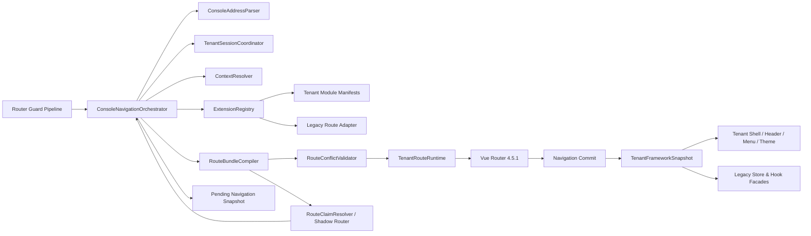
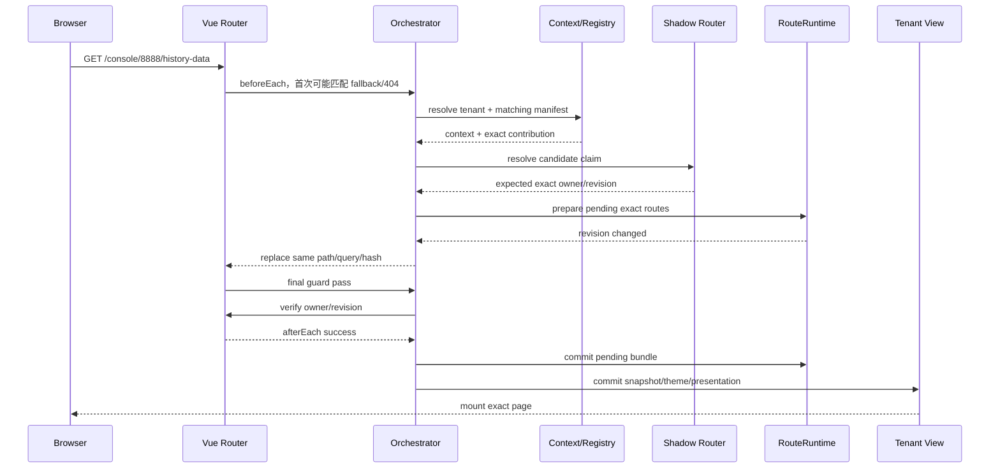

# 多租户前端框架 V2 架构升级与无感迁移实施方案

> 文档状态：**已实施；本文件保留为架构决策与实施记录**
> 版本：实施基线 3.0
> 日期：2026-07-12
> 适用项目：`data-center-vue`

> 阅读提示：本文保留实施前的审计证据和阶段性路径，因此其中提到的旧 `tenant-routes`、
> `tenant-context-routes` 等文件是历史背景，不表示当前仍保留。当前可执行的目录和接入
> 方式以《tenant-console-v2-usage-guide.md》为准。

---

## 0. 审核结论摘要

本方案采用“**稳定 Console Shell + 分层上下文编排 + 模块 Manifest + 精确实例路由 + 内容保真迁移**”。

需要审核的核心决策如下：

1. 将内部稳定父路由从 `/console/:tenantKey` 提升为 `/console`，`TenantLayout` 只作为 Console Shell 挂载一次。
2. 通用租户、项目、设备、历史路由继续作为参数化 fallback；专属实例路由使用实际 URL key 编译成精确 matcher，并在 fallback 之前被 Vue Router 选中。
3. 访问 `/console/8888` 时，在导航提交前注册并重新解析专属路由，最终直接挂载专属页面；`TenantEntry.vue` 的 mount 次数必须为 0。
4. 没有显式 `children` 的页面，作为 `TenantRoot` 的直接子路由渲染；不会被首页、Entry 或隐式 wrapper 包裹。
5. 同一模块的多个顶层路由是 `TenantRoot` 下的同级记录。只有 Manifest 明确声明 `children` 时才产生 RouterView 嵌套。
6. 新租户接入统一写一个模块 Manifest。属于同一租户的 tenant/project/device/history 四级扩展可集中在同一目录和同一 Manifest 中。
7. 可跨租户复用的项目 Profile、设备型号分别放在 `project-profiles`、`device-models`，不再散落在四个 pages 目录中。
8. 业务实现文件内容冻结，但允许整棵目录通过 `git mv` 迁移；`route.ts`、Manifest、Registry、兼容入口等接入元数据允许重写。
9. 框架和公共代码按依赖边界重构，不再采用狭窄文件 allowlist；旧业务代码依赖的公共 import 路径通过稳定 facade 保持可用。
10. 路由、上下文、菜单、Header 名称和主题形成一个不可变 Snapshot，在最终导航确认后一次提交，消除错误页面和标题/主题闪烁。
11. Legacy Route Adapter 仅用于无感迁移；最终模块接入点是 `ExtensionRegistry + TenantModuleManifest`。
12. 本轮不修改后端接口协议、业务请求含义、HTTPS 或其他安全配置。

---

## 1. 范围与代码边界

### 1.1 本轮包含

- Console 四级路由模型：tenant、project、device、history。
- 自定义路由的发现、匹配、编译、注册、替换、卸载和冷刷新恢复。
- 用户/租户会话与页面上下文的导航编排。
- `TenantLayout`、`TenantHeader`、菜单、返回路径、Breadcrumb、Logo 名称和租户主题。
- 旧 Entry、旧 route factory 和旧公共 import 的兼容层。
- 具体业务模块的内容保真目录迁移。
- 测试、CI 门禁、灰度、部署和回滚。
- 因业务目录迁移而必须调整的公共组件加载器，例如 `menu-builder.ts`。

### 1.2 三类修改边界

| 分类 | 规则 | 典型文件 |
|---|---|---|
| 业务实现内容 | 可以移动、不能修改内容 | 具体租户/项目/设备页面、业务 API、地图、图表、CSS、常量、资源 |
| 接入元数据 | 可以重写、迁移或删除 | `route.ts`、`manifest.ts`、route factory、Registry、loader map、兼容 re-export |
| 框架与公共代码 | 可按本方案重构 | router、store、layout、header、hooks、公共主题/菜单/组件加载基础设施 |

“内容不能修改”是针对本次架构迁移的风险控制，不代表这些业务模块今后永远禁止正常迭代。

### 1.3 初始冻结清单

实施阶段 0 需以实际文件清单为准，当前审计建议至少冻结：

```text
src/pages/tenants/ningbo-hky/**          排除 route.ts
src/pages/projects/tianjin/**            排除 route.ts
src/pages/devices/SOB10v1t1/**
src/pages/devices/SOB23BSv1t1/**
src/pages/devices/components/**
```

默认租户、平台租户及后续识别出的具体业务模块，同样按“实现冻结、接入元数据可改”分类。

### 1.4 本轮不包含

- 不修改后端接口地址、请求/响应协议和业务语义。
- 不修改具体业务页面的交互、地图、数据计算、图表 option 或样式。
- 不修改数据库数据。
- 不增加 HTTPS、密钥、密码、认证协议等安全整改要求。
- 不重构 `/admin` 权限业务；只保证其动态路由与 Console Runtime 相互隔离且行为不回归。

---

## 2. 当前实现审计

### 2.1 已确认的框架问题

| 问题 | 当前证据 | 影响 |
|---|---|---|
| 参数父路由限制精确实例路由 | `src/router/index.ts:16` 为 `/console/:tenantKey` | 实例首页难以作为真正的精确 sibling 注册 |
| 默认首页与专属首页都使用空 path | `src/router/index.ts:25` 与宁波 `route.ts:8` | 依赖动态注册时机，语义不清 |
| Guard 只在命中四个 fallback name 后准备 | `src/router/guard.ts:101-115` | 自定义深链首次可能先匹配全局 404，无法稳定准备 |
| 以路由数量判断是否变化 | `src/router/tenant-context-routes.ts:24,56-57` | 替换、同数量变更和失败回滚无法表达 |
| Guard 与 Layout 双重加载 | `src/router/guard.ts` 和 `src/layouts/TenantLayout.vue:9-15` | 重复请求、竞态、闪烁 |
| 一个 Store 混合过多职责 | `src/pinia/stores/tenantContext.ts` | URL 解析、API、实体、路由、菜单、标题相互耦合 |
| 缓存身份不是完整层级键 | `tenantContext.ts:317-347` | 同 projectKey/deviceCode 跨父级可能复用错误实体 |
| 自定义 route 全部挂参数化 TenantRoot | `tenantContext.ts:128-157` | 旧 route 在竞态期间可能匹配其他租户 |
| Header 自己正则解析层级 | `TenantHeader/index.vue:88-100` | 路由语法散落在 UI |
| 主题 token 只挂在 nav | `TenantHeader/index.vue:61-74,158` | TenantLogo、菜单、弹层和公共组件不能稳定继承完整主题 |
| 标题由页面生命周期清理 | `useLogoTitle.ts:30-37`；Layout 使用 `out-in` | 切换时可能短暂回退顶层租户名 |
| 菜单和物理 pages 路径耦合 | `src/common/utils/menu-builder.ts:4,13-17` | 业务页面移动后 glob 和后端组件标识会失效 |
| route name 过于通用 | 天津 route 使用 `index`、`HistoryData` | Vue Router 重名 addRoute 会静默移除旧 route |
| tenant switch 带不可撤销副作用 | `src/pinia/stores/user.ts:88-138` | AbortController 不能阻止迟到请求覆盖 token/activeTenant |

### 2.2 业务迁移依赖结论

- 宁波目录内部存在 `DeviceLocation -> ../apis`、`DeviceLocation -> ../history`、`history -> ../../apis` 等相对依赖，必须把 `apis/DeviceLocation/history` 作为一个完整实现胶囊移动。
- 天津的 `BuoyData.vue`、`ShoreData.vue` 依赖同级 `./apis`，适合整棵移动。
- SOB10/SOB23 页面通过 `../components` 共享设备组件，两个型号目录不能单独移动；必须和 `devices/components` 保持同级拓扑。
- 宁波 `HistoryLayout.vue` 直接读取 `route.params.tenantKey`，不能简单改成纯字面量 matcher。
- SOB 设备和历史页面需要 `device` prop；若以后由 Manifest 直接路由到业务组件，框架必须透明注入该 prop。
- 天津项目首页基于 `route.fullPath` 拼接历史地址；新框架不能添加隐藏 URL 层级。

---

## 3. 架构原则与不变量

1. **有效 URL 不变**：现有书签、刷新、前进后退和应用内跳转保持地址不变。
2. **错误页面不提交**：准备专属 route 时，fallback Entry 或 404 可以是第一次解析结果，但不得 mount。
3. **精确实例优先**：精确业务 route 可以覆盖通用 fallback；两个精确业务 route 不能静默互相覆盖。
4. **单一写入者**：只有 `TenantRouteRuntime` 可以调用 `router.addRoute/removeRoute`。
5. **单一导航编排者**：只有 `ConsoleNavigationOrchestrator` 可以为 Console 导航解析上下文和准备 bundle。
6. **UI 只读已提交状态**：Layout、Header、菜单和业务 facade 不读取半完成的 pending context。
7. **Manifest 依赖倒置**：框架只依赖 Manifest 契约，不直接 import 具体业务实现。
8. **业务内容保真**：目录美观不能成为修改业务文件内部 import 或逻辑的理由。
9. **物理路径不是业务 ID**：route、菜单和后端组件标识使用稳定逻辑 ID，不把新物理路径继续固化为长期契约。
10. **框架失败可诊断、可回滚**：不以空白页、静默 fallback 或刷新浏览器掩盖错误。

---

## 4. 目标架构

整体形态是前端单体内的“垂直业务模块 + 插件式扩展点”，不是引入远程微前端。它保留统一构建、统一类型和原子发布，同时把租户定制与 Router/Store 内核解耦。



### 4.1 组件职责

| 组件 | 单一职责 |
|---|---|
| `ConsoleAddressParser` | 规范化 URL，提取当前可确定的 key、tail 和结构候选 |
| `TenantSessionCoordinator` | 串行协调有副作用的租户切换，处理 supersede 和失败补偿 |
| `ContextResolver` | 加载并校验 tenant/project/device 实体，使用复合缓存键 |
| `ExtensionRegistry` | 自动发现、校验、匹配模块 Manifest |
| `LegacyRouteAdapter` | 把旧 RouteRecord factory 适配为统一 Contribution；仅迁移期使用 |
| `RouteBundleCompiler` | 将 scope 相对路由编译为精确 matcher、具体菜单 URL 和运行时 name |
| `RouteClaimResolver` | 在内存 Router 中逐层解析 candidate，判断扩展 claim，不改生产 Router |
| `RouteConflictValidator` | 校验有效 URL claim、name、redirect、alias 和结构冲突 |
| `TenantRouteRuntime` | 准备、提交、回滚、替换和卸载动态 route |
| `TenantFrameworkSnapshot` | 保存一次成功导航的不可变上下文、导航、展示和主题 |
| `PresentationResolver` | 统一解析 Header 名称、Logo、Breadcrumb、返回路径 |
| `TenantThemeProvider` | 生成并应用语义化主题 token |

---

## 5. 最终路由模型

### 5.1 稳定父路由

```ts
{
  path: "/console",
  name: "tenant-framework:root",
  component: TenantLayout,
  children: [
    {
      path: ":tenantKey",
      name: "tenant-framework:fallback:tenant",
      component: TenantEntry
    },
    {
      path: ":tenantKey/projects/:projectKey",
      name: "tenant-framework:fallback:project",
      component: ProjectEntry
    },
    {
      path: ":tenantKey/projects/:projectKey/devices/:deviceCode",
      name: "tenant-framework:fallback:device",
      component: DeviceEntry
    },
    {
      path: ":tenantKey/projects/:projectKey/devices/:deviceCode/history",
      name: "tenant-framework:fallback:history",
      component: HistoryEntry
    }
  ]
}
```

`/console` 与 `/console/` 不能留下空 TenantLayout。本方案定义为复用现有 `/` 的默认租户选择逻辑，重定向到当前用户的默认租户；没有租户时沿用现有退出/登录逻辑。该判断由 Auth/User 初始化完成后的 Guard/Orchestrator 执行，不能在应用启动时用读取未初始化 Store 的 route redirect function 实现。

### 5.2 精确实例 route

对 URL 中实际使用的 key 编译：

```text
/console/8888
/console/8888/33333
/console/8888/projects/P100
/console/8888/projects/P100/devices/D001
/console/8888/projects/P100/devices/D001/history
```

如果同一个租户可通过 id、tenantCode、slug 或 customDomain 访问：

- Manifest 根据已解析的稳定实体身份匹配。
- matcher 使用本次 URL 的实际 key 编译。
- 从另一别名进入时生成新的 address fingerprint，不错误复用旧 matcher。

### 5.3 literal 与 constrained

纯字面量：

```text
8888/projects/P100
```

精确约束参数：

```text
:tenantKey(8888)/projects/P100
:tenantKey(8888)/projects/:projectKey(P100)
```

两者都只匹配同一个有效地址，但 params 行为不同：

| 模式 | 精确匹配 | `route.params` |
|---|---|---|
| `literal` | 是 | 不自动生成上下文 params |
| `constrained` | 是 | 只生成 Manifest 显式暴露的 params |

策略：

- Legacy Route Adapter 默认使用 `constrained`，并保留旧路由原来可见的 params shape。
- 当前旧自定义 route 都继承 `/console/:tenantKey`，所以默认只暴露 `tenantKey`；不会擅自新增 `projectKey/deviceCode`。
- 宁波整个 `history-data` 顶层 subtree 必须暴露 `tenantKey`。
- 新 V2 Manifest 默认使用 `literal`；确需 params 时显式声明 `exposeParams`。
- `props: true`、`beforeEnter`、redirect function、alias 和命名跳转也纳入 params 依赖审计。
- key 写入自定义正则前必须经过专用转义和编码测试。

Vue Router 4.5.1 中静态段、custom-regexp 参数应高于普通参数段，但不能只依赖文档假设。集成测试必须覆盖先注册 fallback、后 add exact，以及反向注册、remove/re-add 的全部顺序。

### 5.4 有效 URL claim 冲突

`8888` 与 `:tenantKey(8888)` 的 path 字符串不同，但有效 URL claim 相同。冲突校验必须先用当前 context 物化 owner base，并比较子 matcher 的等价/重叠关系：

- exact 与通用 fallback 同 URL：允许，exact 胜出。
- 两个 exact Contribution 同 URL：阻止 bundle。
- literal 与 constrained 同 URL：阻止 bundle，避免 literal 获胜后 params 静默消失。
- alias 是额外 URL claim，必须和普通 path 一起检查重叠。
- redirect target 不是 URL claim；多个 redirect 可以合法指向同一目标，只校验目标存在、参数完整、作用域和循环。
- trailing slash 与大小写不能无条件归一化；claim 比较必须保留每条 route 的 `strict/sensitive` 语义。
- 动态子 path 还需比较 matcher pattern，例如 `reports/:id` 与 `reports/:slug`，不能只检查本次导航的具体 URL。

---

## 6. 直接渲染、同级路由与嵌套规则

### 6.1 无 children 的页面

Manifest：

```ts
[
  { id: "home", path: "", kind: "page", component: HomePage },
  { id: "custom", path: "33333", kind: "page", component: CustomPage }
]
```

租户 key 为 `8888` 时编译成 `TenantRoot` 的两个直接 child：

```text
8888          -> HomePage
8888/33333    -> CustomPage
```

二者是 sibling：

- `HomePage` 不需要 RouterView。
- 访问 `/console/8888/33333` 不会先进入或嵌套 `HomePage`。
- 不经过 `TenantEntry`。
- 不新增 URL 段。

若该旧模块需要保留 `tenantKey`，运行时 matcher 为 `:tenantKey(8888)/33333`，用户看到的有效 URL 仍是 `/console/8888/33333`。

### 6.2 显式 layout

```ts
{
  id: "management",
  path: "management",
  kind: "layout",
  component: ManagementLayout,
  children: [...]
}
```

只有 `kind: "layout"` 才允许 `component + children`，组件必须包含 RouterView。宁波 `HistoryLayout.vue` 属于这一类，其 children 保持原相对结构。

### 6.3 componentless group

`kind: "group"` 不消耗 RouterView，只用于显式组织 children。禁止为了管理 owner 而自动创建 `path: ""` 的 group：

- 若一个租户只配置 `settings`、没有自定义首页，`/console/8888` 必须继续进入 TenantEntry fallback。
- 空 owner group 会抢占该地址并产生空白页，因此不允许。
- 空 path group 必须有明确默认 child 或 redirect。

### 6.4 上下文 prop

Manifest 对 default view 可声明：

```ts
contextProps: { default: ["device"] }
```

实现契约固定为“无 wrapper 的 Vue Router props function”：

- Compiler 闭包捕获本次 bundle 的 immutable resolved context。
- default/named view 分别生成 props function，把声明的实体映射成同名 prop。
- 旧 `props: true` 先映射 route params；object/function 先按 Vue Router 原语义求值，再与 context props 合并。
- 默认 `propMerge: "error"`：两边产生同名 prop 时阻止编译；只有 Manifest 显式选择 `route-wins` 或 `context-wins` 才允许覆盖。
- named views 必须逐 view 声明并校验；Shell 没有对应 named RouterView 时保留 V1，不伪装兼容。

最终 matched leaf 仍是业务页面，不增加组件或 RouterView 层级。SOB Device/History 页面由此继续收到现有 `device` prop。

---

## 7. 模块 Manifest 与 Extension Registry

### 7.1 原生 Manifest 契约

```ts
interface EntityMatchClause {
  tenant?: {
    ids?: string[]
    effectiveKeys?: string[]
    tenantCodes?: string[]
    types?: number[]
    uiProfiles?: string[]
  }
  project?: {
    ids?: string[]
    projectCodes?: string[]
    projectNos?: string[]
    uiProfiles?: string[]
  }
  device?: {
    ids?: string[]
    deviceCodes?: string[]
    modelNumbers?: string[]
  }
}

interface ModuleMatcher {
  anyOf: EntityMatchClause[]
}

type ContextMatcher = ModuleMatcher

interface TenantModuleManifest {
  schemaVersion: 1
  id: string
  revision: string
  match: ModuleMatcher
  scopes: {
    tenant?: ScopeContribution[]
    project?: ScopeContribution[]
    device?: ScopeContribution[]
    history?: ScopeContribution[]
  }
  legacyComponentIds?: Record<string, ComponentLoader>
}

interface ScopeContribution {
  id: string
  match?: ContextMatcher
  matcher: {
    mode: "literal" | "constrained"
    exposeParams?: Array<"tenantKey" | "projectKey" | "deviceCode">
  }
  routes: ConsoleRouteSpec[]
  navigation?: NavigationSpec[]
  presentation?: PresentationSpec
}

type ConsoleRouteKind = "page" | "layout" | "group"
type ContextEntityKey = "tenant" | "project" | "device"

interface ConsoleRouteSpec {
  id: string
  path: string
  kind: ConsoleRouteKind
  component?: ComponentLoader
  components?: Record<string, ComponentLoader>
  children?: ConsoleRouteSpec[]
  claimStructuralPath?: boolean
  routeProps?: RouteRecordRaw["props"]
  contextProps?: Record<string, ContextEntityKey[]>
  propMerge?: "error" | "route-wins" | "context-wins"
  alias?: RouteRecordRaw["alias"]
  redirect?: LocalRouteTarget | RouteRecordRaw["redirect"]
  beforeEnter?: RouteRecordRaw["beforeEnter"]
  meta?: RouteMeta
  strict?: boolean
  sensitive?: boolean
}
```

Manifest 规则：

- 只接收 readonly context，route factory 必须是纯函数。
- 不允许直接调用 Router、Store、API 或操作 DOM。
- route path 必须是 scope-relative；禁止手写 `/console` 绝对前缀。
- 组件必须 lazy import，Manifest 本身可 eager 发现。
- route 使用模块内 local id；Compiler 生成全局 namespaced runtime name。
- redirect 优先引用 local id，不直接依赖全局通用 name。
- matcher、navigation URL 和 presentation 是三个独立产物。
- `claimStructuralPath`、`contextProps` 和 `propMerge` 都是受 schema 校验的正式字段，不能作为未类型化的约定。

Matcher DSL 语义：

- `anyOf` 中 clause 为 OR。
- 同一 clause 内 tenant/project/device 条件为 AND。
- 同一字段数组内的值为 OR；未声明的字段不限制。
- 优先使用稳定实体 id/code/profile；`effectiveKeys` 只用于确实绑定某个 URL alias 的场景。
- 不接受任意业务 predicate，避免 Registry 选择产生不可测试的副作用。

以下是 key=8888 的完整四级接入示意；组件名仅表示契约，不代表要新增或修改现有业务内容：

```ts
export default defineTenantModule({
  schemaVersion: 1,
  id: "tenant:8888",
  revision: "1",
  match: {
    anyOf: [
      { tenant: { tenantCodes: ["8888"] } },
      { tenant: { effectiveKeys: ["8888"] } }
    ]
  },
  scopes: {
    tenant: [{
      id: "tenant-pages",
      matcher: { mode: "constrained", exposeParams: ["tenantKey"] },
      routes: [
        {
          id: "home",
          path: "",
          kind: "page",
          component: () => import("./implementation/TenantHome.vue")
        },
        {
          id: "management",
          path: "management",
          kind: "layout",
          component: () => import("./implementation/ManagementLayout.vue"),
          children: [
            {
              id: "users",
              path: "users",
              kind: "page",
              component: () => import("./implementation/UserManagement.vue")
            }
          ]
        }
      ]
    }],
    project: [{
      id: "project-p100",
      match: { anyOf: [{ project: { projectCodes: ["P100"] } }] },
      matcher: { mode: "literal" },
      routes: [{
        id: "project-home",
        path: "",
        kind: "page",
        component: () => import("./implementation/ProjectHome.vue")
      }]
    }],
    device: [{
      id: "sob10-device",
      match: { anyOf: [{ device: { modelNumbers: ["SOB10"] } }] },
      matcher: { mode: "literal" },
      routes: [{
        id: "device-home",
        path: "",
        kind: "page",
        component: () => import("./implementation/Device.vue"),
        contextProps: { default: ["device"] }
      }]
    }],
    history: [{
      id: "sob10-history",
      match: { anyOf: [{ device: { modelNumbers: ["SOB10"] } }] },
      matcher: { mode: "literal" },
      routes: [{
        id: "history-home",
        path: "",
        kind: "page",
        component: () => import("./implementation/History.vue"),
        contextProps: { default: ["device"] }
      }]
    }]
  }
})
```

关键编译结果：

```text
/console/8888
  -> :tenantKey(8888)
  -> TenantHome，直接进入 TenantRoot

/console/8888/management/users
  -> ManagementLayout/RouterView -> UserManagement

/console/8888/projects/P100
  -> ProjectHome，直接进入 TenantRoot

/console/8888/projects/P100/devices/D001
  -> SOB10 Device + device prop

/console/8888/projects/P100/devices/D001/history
  -> SOB10 History + device prop
```

### 7.2 自动发现

Registry 使用固定字面量 glob 发现 Manifest，例如：

```ts
import.meta.glob("/src/tenant-modules/**/manifest.ts", {
  eager: true,
  import: "default"
})
```

启动/构建测试校验 schema、重复 module id 和依赖边界；业务页面仍然按 route lazy load，不把所有业务 chunk 打进入口包。

### 7.3 同一租户四级集中维护

```text
tenant-modules/tenants/ningbo-hky/manifest.ts
  scopes.tenant
  scopes.project
  scopes.device
  scopes.history
```

只属于该租户的四级扩展都在这里声明，不再要求分别去 tenants、projects、devices、history 四个目录维护。

真正可复用的能力放到独立 Profile：

```text
tenant-modules/project-profiles/tianjin
tenant-modules/device-models/SOB10v1t1
tenant-modules/device-models/SOB23BSv1t1
```

### 7.4 匹配和组合顺序

稳定选择顺序：

```text
稳定实例 id/key 精确匹配
> 租户专属模块内的下级匹配
> uiProfile / project profile / device model 匹配
> generic fallback
```

同一 scope 可以组合互不冲突的 Contribution。V2 不提供“同 path 后注册覆盖”：相同有效 path 或 local slot 一律编译失败；如确实需要替代，应修改匹配条件使同一 context 最终只选择一个 Contribution。

### 7.5 分层 path claim

不能在一开始就把所有 `projects/devices/history` 字样机械地解释为下一级实体。编排流程为：

1. 只解析 tenant key，加载 tenant，并把 tenant Contribution 编译后加入 candidate/Shadow Router。
2. 把 core matcher 与已编译 candidate 加入独立 memory-history Shadow Router，用其 `resolve` 检查目标地址是否已被带 owner/scope meta 的精确 tenant route claim。
3. 未被 claim 且地址符合 `projects/:projectKey` 时，才请求 project。
4. 把 project Contribution 加入 candidate/Shadow Router 后再次 resolve；未被 project route claim 才继续 device。
5. device 同理，最后处理 history。

Shadow Router 只用于匹配，不挂载组件、不执行业务 guard、不修改生产 Router。它与生产环境使用同一 Vue Router 4.5.1 和相同 strict/sensitive 配置；集成测试必须证明同一 route set 的 shadow/production resolve 结果一致。

因此租户可以显式声明 `projects/settings`，项目可以声明 `devices/settings`，不会先请求名为 `settings` 的错误实体。

为防止意外吞掉整个结构命名空间：

- 静态精确 path 可以显式 `claimStructuralPath: true`。
- 跨越 `projects/devices/history` 的动态参数或 catch-all 默认禁止。
- 精确 claim 与下级实际实例地址冲突时，构建/prepare 失败并给出模块 owner。

### 7.6 Route name

- 新 Manifest 的 runtime name 格式使用 `tenant-module:<moduleId>:<scope>:<localId>`，必要时加入实例/版本 fingerprint。
- 模块内 redirect-by-name 在编译时从 local id 一起重写。
- Legacy Adapter 在迁移期按审计结果保留旧 name 或映射到 namespaced name。
- 注册前检查 core、permission routes、active bundle 和 pending bundle 的完整全局 name。
- 不能调用 addRoute 后再处理重复 name，因为 Vue Router 会先静默移除旧同名 route。

---

## 8. Legacy Route Adapter

旧入口在灰度期仍可调用：

```text
getTenantRoutes
getProjectRoutes
getDeviceRoutes
getHistoryRoutes
```

Adapter 把返回值规范化为与 Manifest 相同的 `ScopeContribution`。它是迁移桥，不是最终模块注册中心。

必须递归处理 RouteRecordRaw 的完整兼容面：

- `component` 与 named `components`
- `children`
- `meta`
- `redirect`：path、name、function
- `alias`
- `props`
- `beforeEnter`
- `strict/sensitive`
- route name

“结构可复制”不等于所有 guard/function 的上下文语义天然兼容。`beforeEnter` 和 redirect function 在 Snapshot commit 前运行；若旧函数读取 `tenantContext/userStore` 的目标上下文，它会看到旧 committed state。当前已知宁波/天津 route 没有这类 function，但每个 Legacy 模块仍必须审计：

- 只依赖传入的 `to/from` 和保留 params：可以原样使用。
- 需要目标上下文：接入元数据改用只读 `pendingNavigationAccessor`，或保留 V1。
- 函数位于冻结业务实现且无法适配：标记不兼容并保留 V1，不能承诺零修改兼容。

实现采用结构递归复制，保留 component、function 和 symbol 引用，不修改旧 factory 返回的对象。遇到无法安全转换的记录时：

- 不部分注册。
- 输出 module/scope/route 定位信息。
- 该模块继续走 V1 flag 或明确框架错误页。
- 禁止静默降级到错误的 generic 页面。

原 `tenant-routes.ts/project-routes.ts/device-routes.ts/history-routes.ts` 在所有现有模块转换为 Manifest 后退出；必要时短期保留为调用 Manifest 的 deprecated shim。

---

## 9. 目录目标与内容保真迁移

### 9.1 目标目录

```text
src/
  app/
    router/
      core-routes.ts
      guard-pipeline.ts
      permission-runtime.ts

  framework/
    tenant-console/
      public/
      domain/
        console-address.ts
        manifest.ts
        snapshot.ts
      application/
        context-resolver.ts
        navigation-orchestrator.ts
        presentation-resolver.ts
      infrastructure/
        extension-registry.ts
        legacy-route-adapter.ts
        route-bundle-compiler.ts
        route-claim-resolver.ts
        route-conflict-validator.ts
        tenant-route-runtime.ts
        tenant-session-coordinator.ts

  shells/
    tenant-console/
      TenantLayout.vue
      header/
      theme/

  tenant-modules/
    registry.ts
    tenants/
      default/
      platform/
      ningbo-hky/
        manifest.ts
        implementation/
          apis/
          DeviceLocation/
          history/
    project-profiles/
      tianjin/
        manifest.ts
        implementation/
          apis/
          BuoyData.vue
          DeviceLocation.vue
          ShoreData.vue
    device-models/
      SOB10v1t1/
        manifest.ts
      SOB23BSv1t1/
        manifest.ts
      implementation/
        components/
        SOB10v1t1/
        SOB23BSv1t1/

  pages/        继续承载未迁移的通用页面和后台页面
  common/       暂时保留稳定公共 facade
  pinia/        暂时保留冻结业务使用的 store facade
```

这不是为了目录形式一次性搬空整个项目；本轮只迁移 tenant framework 及其业务模块，其他 admin/pages 可继续留在原位置。

### 9.2 迁移单元

| 当前位置 | 目标迁移单元 | 约束 |
|---|---|---|
| `pages/tenants/ningbo-hky` | `tenants/ningbo-hky/implementation` | 除 route 元数据外整棵保持内部拓扑 |
| `pages/projects/tianjin` | `project-profiles/tianjin/implementation` | 页面与 `apis` 一起移动 |
| 两个 SOB 目录 + `devices/components` | `device-models/implementation` | 三者继续同级 |
| 旧 `route.ts` | 新 Manifest | 接入元数据允许重写，不纳入内容冻结 hash |

### 9.3 稳定公共 facade

冻结业务代码目前依赖：

```text
@/layouts/components/TenantHeader/TenantBreadcrumb.vue
@/pinia/stores/tenantContext
@/pinia/stores/user
@/common/apis/**
@/common/components/MapStyleSwitcher/**
@/common/composables/**
@/common/hooks/**
@/common/utils/**
```

框架实现可以移动，但这些 import 在本轮必须继续解析。策略按优先级：

1. 原路径保留薄 facade/re-export。
2. 对 Vue SFC 使用稳定 wrapper/facade，保持 props/slots 行为。
3. 仅迁移阶段使用精确 alias。
4. 新 Manifest 直接引用新路径后，清理不再有消费者的业务路径 alias。

相对 import 不能依靠 Vite alias 修复，所以必须保持胶囊内部拓扑。

### 9.4 后端菜单组件加载兼容

`menu-builder.ts` 当前只 glob `/src/pages/**/*.vue`。业务模块移动后必须：

- 同时支持 `/src/tenant-modules/**/*.vue` 的 loader。
- 建立“旧逻辑 component id -> 新 loader”的显式迁移表。
- 盘点后端数据库中可能保存的旧组件标识。
- 本轮只在前端维护稳定逻辑 ID 和旧标识映射，不修改后端或数据库；后端改存逻辑 ID 作为未来另案。
- 在删除旧映射前用运行日志和测试证明没有消费者。

alias 不会改变 `import.meta.glob` 的 key，不能把 alias 当作该问题的解决方案。

### 9.5 内容锁

阶段 0 生成 `business-content-lock.json`：

```ts
interface FrozenFileRecord {
  logicalId: string
  sourcePath: string
  targetPath: string
  kind: "text" | "binary"
  normalizedSha256: string
}
```

校验规则：

- 文本只规范化 UTF-8 BOM 和 CRLF/LF；不 trim、不格式化、不改空格。
- 二进制使用原始 SHA-256。
- 每个 logicalId 在目标位置必须恰好出现一次。
- 允许批准的 old -> new rename；拒绝遗漏、重复、额外复制和内容变化。
- `git diff --find-renames=100% --summary` 作为辅助证据，hash 才是门禁。
- 冻结目录不执行 ESLint `--fix` 或格式化器；新增 `lint:check` 只读检查。
- Linux CI 检查路径大小写和动态 import，避免 Windows 下隐藏的大小写错误。

---

## 10. Console 导航编排

### 10.1 分阶段导航

Orchestrator 在一次导航中创建一个 navigation-scoped candidate plan。tenant/project/device/history Contribution 按层级逐步编译并追加到 Shadow Router；每次追加后可以 resolve 检查 claim。完整 candidate 通过跨 scope 校验后，才一次性交给生产 `TenantRouteRuntime.prepare`，不会把半成品 route 加入生产 Router。

```text
Auth/User 初始化
-> ConsoleAddressParser 读取 tenant + raw tail
-> TenantSessionCoordinator 串行切换/解析租户
-> 创建 candidate plan 与 Shadow Router
-> 编译/校验 tenant Contribution，加入 Shadow Router
-> shadow resolve：tenant exact route 是否 claim
-> 必要时加载 project，加入 project candidate，再 shadow resolve
-> 必要时加载 device，加入 device candidate，再 shadow resolve
-> 必要时加入 history candidate
-> 对完整 candidate 执行最终跨 scope 校验
-> TenantRouteRuntime.prepare 一次性准备生产 pending bundle
-> 返回相同 path/query/hash 重新匹配
-> beforeResolve 验证 matched owner/revision
-> afterEach 成功后提交 snapshot 和 route bundle
```

所有 `/console` 导航都执行幂等 prepare，包括：

- 已经匹配四个 fallback 的地址。
- 第一次匹配全局 404 alias 的自定义深链。
- 应用内 push。
- 浏览器前进后退。

不能再以 matched name 是否属于四个 Entry 作为是否准备的条件。

### 10.2 冷刷新时序



第一次导航没有 commit，因此 TenantEntry、默认页面和 404 都不会 mount。

### 10.3 matched 断言与循环保护

- 每个编译 route 写入内部 owner/scope/revision meta。
- prepare 生成 `ExpectedResolution` 联合类型：`extension(owner/revision)`、`core-fallback(name/address)`、`console-redirect`、`not-found/error`。
- rematch 后以最终 `to.matched` 按联合类型断言；合法 generic fallback 不要求 extension owner/revision。
- 对 redirect route 显式跟随已校验的 redirect graph，分别断言原始记录、最终 leaf、owner/revision 和 params；`router.resolve(rawLocation)` 的 redirecting record 不能代替最终 leaf 断言。
- signature 未变时不得再次 add/remove。
- 同一路径 rematch 及随后发生的业务 route redirect 都复用原 `logicalNavigationId/rematchToken/leaseId`；新 guard pass 不能把第一 pass 判为 superseded，也不能创建第二套重复 route。
- changed 后最多发生一次同 revision rematch。
- afterEach 收到预期内部 replace 的 navigation failure 时不 rollback；只有最终 success 才 commit，真正取消、错误或外部 supersede 才 rollback。
- 断言失败时中止并展示可诊断框架错误，不能无声提交 fallback。

### 10.4 并发与租户会话副作用

`switchTenantByKey` 会切换服务端租户并更新 token；单纯 AbortController 不能撤销。

目标策略：

- `TenantSessionCoordinator` 对 tenant switch 串行化。
- 新导航把旧 navigation 标记为 superseded；旧导航不能提交 route/context/UI。
- 队列可合并到最后一个目标，A -> B -> C 最终只允许 C 页面提交。
- token、activeTenant、memberProfile 和 framework snapshot 必须属于同一 session revision。
- switch 成功但后续导航失败时，执行补偿切回已提交租户，或进入一致的可恢复错误态。
- project/device 普通读取可使用 AbortController、请求去重和 navigationId 双重校验。
- 在压力测试证明正确前，不声称 tenant switch 可取消。

### 10.5 缓存键

```text
tenant: tenantId + effectiveTenantKey
project: tenantId + projectId/effectiveProjectKey
device: tenantId + projectId + deviceId/effectiveDeviceCode
history routes: tenantId + projectId + deviceId + module revision
```

不能只用 projectKey 或 deviceCode。

### 10.6 导航副作用与失败边界

一次 `logicalNavigationId` 同时管理 route listener、browser tab/favicon、NProgress 和诊断/埋点：

- 内部 exact rematch、已验证的模块 redirect 和其中间 navigation failure 不发布 `setRouteChange`、标题、favicon 或成功埋点。
- NProgress 只 start 一次，并在 logical navigation 最终 success/error/cancel 时结束一次。
- `updateBrowserTab` 只消费最终 committed route + Snapshot。
- Guard 的现有 afterEach 副作用拆到 logical-navigation commit handler，不再对每个 Router pass 无条件发布。

失败结果必须分类，不能都落到 generic fallback：

| 结果 | 行为 |
|---|---|
| 实体有效但没有 custom route | 合法 core fallback |
| tenant/project/device 不存在 | 对应 context not-found |
| 当前用户无权限 | 明确 403/无权限页 |
| 网络/超时 | 可重试 error，不伪装成“无定制” |
| Manifest/Compiler/Runtime 失败 | V1 模式继续 V1；V2 显示可诊断 module error |
| beforeEnter abort/throw | rollback pending lease，保留旧 Snapshot |
| 已验证的内部 redirect | 继承 logical navigation/lease，继续最终断言 |
| async component import rejection / router.onError | rollback/恢复旧 route，显示 chunk error 与 retry |

有旧 committed Snapshot 时，准备和失败期间保持旧页面/Header/theme；首屏没有旧 Snapshot 时显示 app-level loading boundary，失败后显示 error + retry。任何失败都要验证 pending lease 清理、旧 Snapshot/theme 保留，以及必要的 tenant session 补偿。

---

## 11. Route Runtime

### 11.1 Bundle

```ts
interface CompiledConsoleBundle {
  ownerTenantId: string
  effectiveAddress: ConsoleAddress
  contextFingerprint: string
  signature: string
  revision: number
  scopes: Partial<Record<ConsoleScope, CompiledScopeBundle>>
  matcherRoutes: RouteRecordRaw[]
  navigation: NavigationItem[]
}
```

signature 至少包含：

```text
实体稳定 id + 实际 URL keys
+ tenant/project uiProfile
+ device model
+ manifest id/revision
+ matcher mode/exposed params
+ route contribution hash
```

### 11.2 prepare / commit / rollback

`TenantRouteRuntime` 使用两阶段 lease：

```text
prepare(candidate)
  -> 完整编译和校验
  -> 注册 pending route 或执行可回滚 swap
  -> 返回 lease/revision

commit(lease)
  -> 提升 candidate 为 active
  -> 卸载已过期 active route

rollback(lease)
  -> 移除 pending
  -> 必要时恢复旧 bundle
```

- 不以 `router.getRoutes().length` 判断变化。
- 每个 `addRoute` 返回的 remover 必须归属明确的 scope lease。
- Runtime 先按 scope 计算 delta；tenant scope 未变时直接复用 active lease，project 变化只级联替换 project/device/history，不把未变化 route 再 add 一遍。
- bundle 分离 `matcherSignature` 与 `context/presentationSignature`；只有 matcher 表变化才 replace/rematch，单纯实体展示、菜单或主题变化直接提交新 Snapshot。
- 非重叠的 pending claim/name 可以与旧 active route 暂时共存。
- 相同有效 claim、相同 name 或同 tenant 新 revision 不能共存：完成 shadow validation 后执行同步可逆 swap，保存旧 raw route/lease，先卸旧、再加新；失败则移除 partial 并恢复旧 route。
- 最终 afterEach commit 不再执行 addRoute、校验或其他可失败工作，只提升引用并调用已知旧 lease 的 remover；真正的注册风险必须发生在导航确认前。
- 离开 Console 的导航只有在无 failure 的 `afterEach` 才释放 active bundle；被取消的离开导航不能破坏当前页面 route。
- logout 清理 tenant runtime 和 permission runtime；二者 owner 分离。

---

## 12. Context Snapshot 与兼容 Store

```ts
interface TenantFrameworkSnapshot {
  navigationId: number
  sessionRevision: number
  routeBundleRevision: number
  scope: "tenant" | "project" | "device" | "history"
  address: {
    tenantKey: string
    projectKey?: string
    deviceCode?: string
    tail: string[]
  }
  tenant: Tenant
  project?: Project
  device?: Device
  navigation: NavigationItem[]
  presentation: ResolvedPresentation
  theme: ResolvedTenantTheme
}
```

状态分为：

- `pendingNavigation`：仅 Orchestrator/Runtime 可见。
- `committedSnapshot`：Shell、Header、菜单和兼容 facade 只读。

现有 `src/pinia/stores/tenantContext.ts` 在迁移期改为 facade，保留冻结业务需要的公开 getter，例如：

```text
currentTenant/currentProject/currentDevice
currentTenantKey/currentProjectKey/currentDeviceCode
currentHomePath/currentProjectPath/currentDevicePath
isHistory
```

这些 getter 从 Snapshot 派生，不再自行正则解析路由、请求 API 或 addRoute。

`useTenantRoute` 可为框架代码提供 typed address，但不伪造 `route.params`；冻结业务直接读取 params 的兼容由 constrained matcher 负责。

---

## 13. Header、菜单、名称与主题

### 13.1 名称解析

`PresentationResolver` 对 primary/fullName 分别按最近层级解析，两者字段顺序不同：

```text
primary:
  scoped lease.primary
  -> route/manifest primaryName
  -> device displayName/deviceName/modelName
  -> project displayName/shortName/name
  -> tenant displayName/shortName/name
  -> 平台默认文案

fullName:
  scoped lease.sub
  -> route/manifest fullName
  -> device deviceName/modelName
  -> project name
  -> tenant name
  -> 空
```

每个字段都独立向上继承。Legacy Adapter 明确执行 `route.meta.logoTitle.primary -> primaryName`、`route.meta.logoTitle.sub -> fullName`；`useLogoTitle({ primary, sub })` 映射为最高优先级的当前 navigation scoped lease。

字段语义：

- `undefined`：继承上一级。
- 非空字符串：使用当前级。
- `null`：显式隐藏该字段。
- primary 与 fullName 相同则隐藏重复 subtitle。

为保持旧行为，Legacy `logoTitle` 或 `useLogoTitle` 中的 `null/undefined` 都按“未提供，继续继承”处理；只有原生 V2 Manifest 的显式 `null` 才表示隐藏。两套语义分别测试，不能在 Adapter 中混用。

因此“当前级未配置就显示上一级，配置了就显示当前级”成为纯函数规则，不由组件 mount/unmount 时机决定。

### 13.2 原子提交与标题 lease

- 导航期间保留完整旧 Header、菜单和主题。
- 最终 route 成功后，Snapshot、presentation、theme 一次提交。
- V2 TenantLayout 移除当前 page-level `transition mode="out-in"`，按 `snapshot.navigationId` 同步替换最终 route component；旧 A DOM 不能在 B Snapshot 提交后继续 leave。
- 若未来恢复动画，必须把 page/Header/theme 作为同一 revision 的完整 Shell 做原子 transition，不能只 cross-fade page。
- `useLogoTitle` 保留兼容 API，但内部改为带 `navigationId/routeKey/ownerToken` 的 lease。
- 旧页面卸载只能释放自己的 lease，不能清除新页面标题。

允许的可见状态只有：

```text
A 页面 + A 名称 + A 菜单 + A 主题
B 页面 + B 名称 + B 菜单 + B 主题
```

### 13.3 Theme Provider

主题来源：

```text
tenant.extra.themeColor
-> module theme default
-> 系统默认色
```

Provider 校验颜色并生成语义 token：

```text
--tenant-primary
--tenant-primary-rgb
--tenant-on-primary
--tenant-surface
--tenant-text
--tenant-muted
--tenant-header-bg
--tenant-header-text
--tenant-focus
```

同时保留兼容 alias：

```text
--primary
--accent
--el-color-primary
--tenant-header-*
```

应用边界：

- token 挂在整个 Tenant Shell，而不是 Header nav。
- Element Plus 等 Teleport 到 body 的弹层同步获得当前 session token。
- 离开 Console/logout 时恢复系统 token。
- TenantLogo、DesktopNav、MobileMenu、Breadcrumb 和允许修改的公共组件统一消费语义 token。
- 公共 JS 图表组件通过 `useTenantTheme().chartPalette` 响应 theme revision。
- 冻结业务实现内部的硬编码图表颜色不在本轮修改；保持原样并做视觉回归。

### 13.4 NavigationModel

菜单不再直接使用 compiled matcher path：

```text
matcher: :tenantKey(8888)/history-data
menu URL: /console/8888/history-data
```

Compiler 单独输出具体 `NavigationItem`：

```ts
interface NavigationItem {
  id: string
  label: string
  href: string
  activeMatch: "exact" | "prefix"
  order: number
  hidden: boolean
  children?: NavigationItem[]
}
```

Header、移动菜单、Breadcrumb 和返回按钮只读 Snapshot 的 address/navigation，不再各自正则解析 `route.path`。

---

## 14. 依赖边界

目标依赖方向：

```text
app -> framework application/infrastructure
shells -> framework public
tenant-modules/manifest -> framework public + 自己的 implementation
tenant-modules/implementation -> 稳定 shared/public facade
framework -X-> tenant module implementation
```

门禁：

- `router.addRoute/removeRoute` 只能出现在 TenantRouteRuntime 和独立 PermissionRuntime。
- Manifest 不得 import app router、Pinia 内部 store 或其他租户 implementation。
- 新模块不得 import `@/pages/...` 物理业务路径。
- tenant-owned 下级扩展优先留在同一 tenant module，不创建跨目录反向依赖。
- 用 ESLint boundaries 或等价静态检查锁定。
- 旧冻结业务暂时违反新边界时，通过 facade 兼容，不修改其内容。

---

## 15. 实施阶段

### 阶段 0：基线、分类和内容锁

- 固化现有四级 URL、宁波、天津、SOB10/SOB23 的行为基线。
- 记录 F5、前进后退、菜单、redirect、props、API 次数、Header 和主题截图。
- 生成冻结文件清单、old -> new 映射和 normalized SHA-256。
- 审计 route name、route.params、props、beforeEnter、redirect、alias 和后端 component id。

退出条件：任何后续回归都能被自动化或明确 smoke 发现。

### 阶段 1：框架骨架，flag 关闭

- 新增 domain types、Parser、Snapshot、Registry、Compiler、Validator、Runtime。
- 新增兼容 public facade。
- 建立 unit/router integration 测试。
- V1 仍负责运行，用户行为不变。

### 阶段 2：原生 Manifest 与 Shadow 比较

- Manifest 暂时指向旧物理业务文件。
- Legacy Adapter 与原生 Manifest 输出统一 Contribution。
- V2 只计算，不 addRoute；比较最终有效 URL、逻辑 component id、children、redirect、meta、params shape 和 navigation URL。
- 不比较 dynamic import 函数对象引用。

### 阶段 3：稳定 `/console` Parent 与单一 Orchestrator

- `TenantRoot` 提升到 `/console`。
- 四个参数 route 保持 Entry fallback。
- 尚未原生迁移的既有 custom route 必须由 Legacy Adapter 产出等价 Contribution；不能因 V2 mode 或灰度名单消失。
- 所有 Console 地址进入统一 prepare。
- 删除 TenantLayout 的 `route.fullPath -> fetchData` watcher。
- 定义 `/console` 默认租户跳转。

退出条件：未配置自定义模块的租户与 V1 行为一致。

### 阶段 4：宁波 exact route 试点

- 宁波 Manifest 使用 constrained tenantKey。
- `path: ""` 与 `history-data` 编译为 TenantRoot 顶层 siblings。
- children、命名 redirect 和 HistoryLayout 保持行为。
- `/console/<宁波实际key>` 的 TenantEntry mount 次数为 0。

### 阶段 5：项目、设备、历史

- 天津项目 Profile 接入，URL 不增加层级。
- SOB 型号 Manifest 注入 `device` prop。
- 四级 exact/fallback、深链刷新和 claim 流程全部启用。
- 未配置 Profile 的实例继续走 Entry fallback。

### 阶段 6：内容保真目录迁移

- 按第 9.2 节执行整棵 `git mv`。
- 更新可编辑 Manifest、Registry、Entry 和 loader map。
- 保留必要的旧 import facade/alias。
- 逐文件校验 normalized hash。
- `tenantRouterMode=v1` 与 `v2` 均需 build/smoke 通过；为 flag 回滚所需的 shim 在回滚窗口内继续保留。

### 阶段 7：Snapshot Presentation 与 Theme

- Header、菜单、Breadcrumb、返回路径改读 committed Snapshot。
- 标题 lease 与页面生命周期解耦。
- Theme token 提升到 Tenant Shell 和 portal boundary。
- 允许修改的公共图标/组件接入语义 token。

### 阶段 8：V2 收口与 V1 兼容包保留

在覆盖率和灰度达标后：

- V2 代码完全停止依赖 RouteSlot、prefixRoutes、旧 fetchData、fallback-name 特判和 route count 判断。
- V1 Router、Entry 专属分支、四个集中 route source 及其必要 shim 收口到明确的 legacy compatibility set。
- legacy set 只由 `tenantRouterMode=v1` 使用，不允许 V1/V2 对同一个 Router 同时 add route。
- 四个 Entry 在 V2 中继续作为 generic fallback。

只要还承诺 flag 回滚，不能删除 legacy set。

### 阶段 9：灰度、部署与回滚演练

- 测试环境 -> 内部租户 -> 单一低风险租户 -> 宁波/天津专项 -> 全量。
- 每个阶段验证业务 hash、路由指标、错误日志和关键 smoke。
- 完成 flag 与构建产物两级回滚演练。

### 后续另案：V1 正式退役

V2 全量运行并超过约定回滚窗口后，另行审核是否删除 legacy set、迁移 alias 和 V1 flag。V1 退役后只保留构建产物回滚；不把该删除动作混入本轮“可 flag 回滚”的 Definition of Done。

---

## 16. 计划中的主要文件变化

### 16.1 新增

```text
src/framework/tenant-console/**
src/app/router/**
src/shells/tenant-console/**
src/tenant-modules/**
tests/tenant-console/unit/**
tests/tenant-console/router/**
tests/tenant-console/component/**
tests/e2e/tenant-console/**
tools/tenant-migration/business-content-lock.*
```

### 16.2 重构或转为 facade

```text
src/router/index.ts
src/router/guard.ts
src/router/tenant-context-routes.ts
src/pinia/stores/tenantContext.ts
src/pinia/stores/user.ts                   仅租户 session 协调职责
src/layouts/TenantLayout.vue
src/layouts/components/TenantHeader/**
src/common/hooks/useTenantRoute.ts
src/common/composables/useLogoTitle.ts
src/common/utils/menu-builder.ts
types/vue-router.d.ts
```

此清单用于实施导航，不是旧式修改 allowlist。只要遵守第 1、9、14 节边界，框架/public 文件可按实际依赖调整；若需要修改冻结业务内容，则必须暂停并重新审核。

---

## 17. 测试与验收矩阵

### 17.1 Router unit/integration

- Vue Router 4.5.1 下 literal、constrained、fallback 的优先级。
- fallback 先注册/exact 后注册，以及反向顺序、remove/re-add。
- tenant/project/device/history 四级 params shape。
- regex 特殊字符转义、URL 编码、大小写、尾斜杠。
- literal 与 constrained 相同有效 URL 的冲突。
- 重复 name 不触发 Vue Router 静默替换。
- alias、props、beforeEnter、named views、strict/sensitive。
- 宁波 history-data -> NB00 redirect 全链路：原始 record、最终 leaf、owner/revision、tenantKey params。
- componentless group 和 layout RouterView。
- 没有自定义首页但有 settings 时，根地址仍走 fallback。
- `projects/settings`、`devices/settings` 的分层 claim。
- matcher path 与 concrete menu href 分离。
- Shadow Router 与生产 Router 对相同 route set 的 resolve 结果一致。
- 两个 redirect 指向同一 target 合法，alias claim 冲突被阻止。
- existing props true/object/function 与 contextProps 的三种 merge 策略。

### 17.2 导航与上下文

- `/console/8888` 冷刷新，TenantEntry mount = 0。
- `/console`、`/console/` 和无可用租户时的默认跳转。
- `/console[/]` 覆盖 user 未初始化、query/hash 保留和 redirect-loop 防护。
- 合法 core fallback 通过 ExpectedResolution 断言。
- internal replace 两个 guard pass 只产生一个 logical navigation 和一次 commit。
- same-path/new-revision reversible swap。
- tenant scope lease 复用，project delta 只级联 project/device/history。
- 首次落入 404 alias 的自定义深链仍能 prepare/rematch。
- query/hash 完整保留。
- 应用内 push、replace、前进、后退。
- 从 admin 进入 console、离开 console、取消离开导航。
- bundle 卸载后再次前进/后退。
- tenant alias 切换。
- V2 会话中平台用户切到 native 租户、legacy-only 租户和真正无 custom route 租户。
- 同 key 跨 tenant/project 不复用实体。
- A -> B -> C 慢响应只提交 C。
- tenant switch 成功后下级失败的补偿。
- logout 期间存在 pending navigation。
- 连续 100 次 tenant/project/device 切换后，route 数、scope lease/remover、watcher 和 portal token 不增长。
- 相同 matcher/context signature 不重复 addRoute；相同请求 key 不重复 API。
- resolver 404/403/network 分别进入 not-found/forbidden/retry error，不能误进 fallback。
- beforeEnter abort/throw/内部 redirect、async import rejection 和 router.onError 的完整失败生命周期。
- 上述每种失败都断言 pending lease=0、旧 route/Snapshot/theme 保留，以及需要时 session 补偿成功。

### 17.3 组件与展示

- TenantLayout 一次挂载。
- custom route 不挂载四个 Entry。
- SOB 页面收到正确 device prop。
- page/Header/menu/theme 属于同一 navigation revision。
- logical navigation 的 route listener、browser tab/favicon、NProgress 和成功埋点只发布/结束一次。
- 首屏无 Snapshot 时 loading -> error -> retry；有旧 Snapshot 时失败不闪空白页。
- primary/fullName 按 undefined/null/显式值继承。
- Legacy `meta.logoTitle.primary/sub` 与 `useLogoTitle` 映射保持旧语义。
- A 页面 lease 卸载晚于 B 页面 lease 创建时，不得清除 B 的 primary/fullName。
- 逐帧 DOM/截图验证页面、Header、菜单和主题始终属于同一 navigation revision。
- 快速切换无一帧顶层租户名闪烁。
- TenantLogo、菜单、Breadcrumb、Element Plus portal 获得正确 token。
- 冻结业务布局、内容和交互无非预期变化；公共主题修复按批准的新颜色基线比对，除此之外无视觉 diff。

### 17.4 内容与构建

- 所有冻结文件 normalized hash 一致。
- approved rename 映射完整且无重复。
- 旧 facade import 与新 Manifest import 均可解析。
- `import.meta.glob` 和 legacy component-id loader 可加载移动后的模块。
- Linux 大小写敏感构建通过。
- 所有 lazy chunk 在 production preview 可加载，无 404。
- Manifest eager 发现不把 implementation 业务 chunks 打进入口 bundle。
- history fallback、Vite public base、四级 F5 通过。

### 17.5 建议构建门禁

实施时补齐“不会修改受版本控制源码”的门禁；build/test 可以写入依赖、缓存、dist 和测试输出，但结束后源码工作树必须干净：

```text
pnpm install --frozen-lockfile
pnpm lint:check
pnpm typecheck
pnpm test:unit --run
pnpm test:router --run
pnpm test:component --run
pnpm verify:business-content
pnpm build
pnpm test:e2e:build
pnpm preview:smoke
```

当前 `pnpm lint` 带 `--fix`，不得把它直接用作冻结内容校验。

---

## 18. 部署、灰度与回滚

### 18.1 Feature Flag

配置拆成两层：

```text
tenantRouterMode = v1 | v2
tenantModuleSource.tenants = native | legacy
tenantModuleSource.scopes.tenant = native | legacy
tenantModuleSource.scopes.project = native | legacy
tenantModuleSource.scopes.device = native | legacy
tenantModuleSource.scopes.history = native | legacy
tenantPresentationV2
tenantThemeV2
```

- `tenantRouterMode` 在创建 Router 前确定，一次会话不热切 V1/V2 runtime。
- V2 内的 tenant/scope 灰度只选择 Contribution 来自 native Manifest 还是 Legacy Adapter，不允许把已有 custom route 直接关闭。
- 已存在 custom route 的实例必须由 native 或 legacy 产出等价 exact/constrained Contribution；只有原本确实没有 custom route 时才进入四个 Entry fallback。
- 因此平台用户在同一 V2 会话切到尚未原生迁移的租户时，仍由 Legacy Adapter 正常打开其专属深链，不会因 allowlist 变成 404。
- scope 依赖按 tenant -> project -> device -> history 级联；下级使用 native source 也不会绕过上级 context resolver。
- Router mode 灰度按会话/构建；native/legacy source 按完整租户选择，不在同一租户内随机分流。
- V1 与 V2 在迁移期共享 URL 和业务 API，不需要数据迁移。

### 18.2 无感部署要求

- URL、Vite base 和服务端 SPA history fallback 不变。
- 生产构建使用带 hash 的静态资源。
- 发布采用原子切换，保留 N-1 构建的静态 chunk 一个回滚窗口，避免老会话动态 import 404。
- 新 index 生效前确保全部新 chunk 已上传。
- 不要求用户清理缓存或更新书签。
- 不修改后端、数据库或 HTTPS 配置。

### 18.3 回滚

1. 将下一次启动的 `tenantRouterMode` 切回 `v1`，新会话使用完整 legacy compatibility set。
2. 切回上一前端构建产物。

Runtime 回滚还需保证：

- pending bundle 被清理。
- active V1/V2 route 不混用。
- Snapshot、token 和 activeTenant 属于同一 session revision。
- 原四级 URL 切回后仍可直接刷新。

---

## 19. 主要风险与控制

| 风险 | 控制 |
|---|---|
| constrained 正则转义错误 | 单一 escape utility + 编码/特殊字符 Router 集成测试 |
| literal 抢 constrained 导致 params 消失 | 按有效 URL claim 校验，不允许二者并存 |
| addRoute 重名静默删除旧 route | 注册前全局 name 校验；新 name 命名空间化 |
| 深层地址先匹配 404 | 所有 Console path 都 prepare，导航前 rematch |
| 空 owner group 抢首页 | 不生成 owner group；顶层 route 直接 sibling |
| Layout 缺 RouterView | Manifest kind/schema + component contract 测试 |
| 设备业务页丢失 prop | contextProps binder + 组件测试 |
| A/B/C 租户切换 token 混乱 | 串行 session saga、revision、补偿和压力测试 |
| 业务移动破坏相对 import | 整棵胶囊移动 + content hash |
| 旧公共 import 失效 | facade/alias + import graph test |
| `import.meta.glob` 找不到新页面 | 新 loader map + legacy logical-id 映射 |
| 菜单生成 constrained 字符串 | matcherRoutes/navigationRoutes 分离 |
| 离开导航取消后 route 已被删 | afterEach commit/cleanup + lease rollback |
| 发布后老会话 chunk 404 | 原子发布并保留 N-1 hashed assets |

---

## 20. 最终效果

### 20.1 专属租户首页

```text
访问 /console/8888
-> resolve tenant
-> Registry 选中该租户 Manifest
-> Compiler 生成 8888 或 :tenantKey(8888)
-> Runtime 在导航提交前注册并 rematch
-> exact matcher 胜出
-> 专属页面直接渲染到 TenantLayout RouterView
-> TenantEntry 从未 mount
```

### 20.2 专属子页

```text
Manifest 顶层 path: "33333"
-> /console/8888/33333
-> 与首页 route 同级
-> 页面直接渲染到 TenantRoot
```

### 20.3 显式嵌套布局

```text
Manifest path: "management" + kind: "layout" + children
-> ManagementLayout 渲染到 TenantRoot
-> children 渲染到 ManagementLayout 的 RouterView
```

### 20.4 普通实例

```text
/console/9999
-> 没有 custom home claim
-> :tenantKey fallback
-> 继续使用 TenantEntry/默认页面
```

项目、设备和历史遵循完全相同的 exact-first、fallback-second 规则。

### 20.5 维护体验

新增专属租户时：

1. 在 `tenant-modules/tenants/<tenant>` 建一个 Manifest。
2. 业务实现放在同一模块的 implementation 胶囊。
3. tenant/project/device/history 四级 Contribution 可在同一 Manifest 维护。
4. 不修改 Router、Guard、Store switch 或四个集中式 route map。
5. Registry 自动发现，schema/conflict/test 在构建期给出反馈。

---

## 21. Definition of Done

- [ ] `TenantRoot` 内部父级为 `/console`，所有现有有效 URL 不变。
- [ ] `/console` 与 `/console/` 不产生空白 Layout。
- [ ] 专属实例生成 literal 或 constrained 精确 matcher。
- [ ] `/console/8888` 直接渲染专属页面，TenantEntry mount = 0。
- [ ] tenant/project/device/history 四级 exact/fallback 均通过。
- [ ] 无 children 页面直接作为 TenantRoot child。
- [ ] 顶层 custom routes 默认是 siblings，只有显式 children 才嵌套。
- [ ] Legacy params、props、redirect、alias、beforeEnter 和 named views 兼容。
- [ ] 所有 Console 导航由一个 Orchestrator 准备。
- [ ] 只有 TenantRouteRuntime 操作 tenant add/removeRoute。
- [ ] Runtime 使用 signature、revision、lease 和 remover，不使用 route count。
- [ ] 冷刷新、404 深链、query/hash、前进后退通过。
- [ ] resolver/guard/redirect/chunk/router.onError 的失败矩阵全部 rollback，且逻辑导航副作用只发布一次。
- [ ] A -> B -> C 无迟到 token/context/route/UI 提交。
- [ ] 连续 100 次层级切换后 route/lease/remover/watcher/portal token 无增长，相同 signature 无重复 addRoute/API。
- [ ] Header 名称、菜单和主题没有可见中间态。
- [ ] TenantLogo/菜单/公共主题 token 作用域正确。
- [ ] 同一租户的四级定制可在一个模块维护。
- [ ] 所有已迁移模块由 Registry/Manifest 接入。
- [ ] V2 下所有未迁移 custom 模块由 Legacy Adapter 等价接入，不出现灰度租户深链 404。
- [ ] 冻结业务文件内容 hash 完全一致。
- [ ] 相对依赖拓扑或稳定 facade 保持可用。
- [ ] 旧 component id 与动态 import 无失效 chunk。
- [ ] Manifest eager discovery 不把 implementation 业务 chunks 打进入口 bundle。
- [ ] admin 权限路由行为无回归。
- [ ] 在 flag 回滚窗口内，V1 legacy compatibility set 与所有必要 shim 保持可构建、可 smoke。
- [ ] 不修改业务 API 协议、业务实现内容或 HTTPS 配置。
- [ ] production build、Router 集成、E2E、preview smoke 通过。
- [ ] flag 回滚和构建产物回滚完成演练。

---

## 22. 编码前审核清单

请确认以下决策：

1. 同意“业务实现内容冻结，但允许按批准映射移动目录”。
2. 同意 route/Manifest/Registry/兼容入口属于可改接入元数据。
3. 同意框架/public code 按依赖边界重构，不使用旧文件 allowlist。
4. 同意 `TenantRoot` 提升为 `/console`。
5. 同意 `/console` 与 `/console/` 进入当前用户默认租户。
6. 同意 exact matcher 优先、四个 Entry 作为兼容 fallback。
7. 同意所有 Legacy route 默认 constrained，并按旧 params shape 暴露参数。
8. 同意顶层 custom routes 直接作为 TenantRoot siblings。
9. 同意同一租户的四级扩展集中到一个租户模块。
10. 同意整棵迁移宁波、整棵迁移天津、SOB 与 shared device components 同级迁移。
11. 同意以 normalized content hash + rename mapping 证明业务内容未改。
12. 同意 Manifest 分层 claim，避免把自定义 `projects/settings` 误当实体 key。
13. 同意 Snapshot 原子提交和 TenantSessionCoordinator 串行租户切换。
14. 同意 Header/主题改造只修改框架与允许修改的公共组件，不改冻结业务图表。
15. 同意 V2 移除当前 page-level `transition mode="out-in"`，以保证 page/Header/theme 同 revision 原子切换。
16. 同意本轮不包含后端协议、业务逻辑或 HTTPS 整改。
17. 同意按阶段、feature flag、专项 smoke 和可回滚方式实施。

审核结论：

```text
[ ] 同意按 Draft 3.0 分阶段实施；任一阶段退出门禁未通过则不进入下一阶段
[ ] 有条件同意，修改意见：
[ ] 暂不同意，原因：

审核人：
审核日期：
```

一次批准覆盖本方案第 0-9 阶段的框架工作、接入元数据调整和已列明的内容保真迁移；阶段门禁用于阻止带风险继续推进，不默认要求每阶段重新授权。若需要修改冻结业务内容、改变 URL/后端协议、扩大到本方案外的业务，必须暂停并重新审核。

未获得明确同意前，不开始应用代码、业务目录或构建配置的重构。
