# 多租户 Console V2 使用手册

本文是当前代码的使用说明，而不是未来规划。它说明如何在不修改已有业务实现内容的前提下，为租户、项目、设备和历史页接入定制页面与子路由。

## 1. 最终结构与职责

```text
src/
├─ router/
│  ├─ index.ts                         # Router 组装、Guard 与会话清理接线
│  ├─ routes.ts                        # 静态、后台动态、Console 路由定义
│  ├─ dynamic-runtime.ts               # 后台动态路由整批替换与退出清理
│  └─ guard.ts                         # 登录后预解析 Console 导航、注册精确路由并 rematch
├─ framework/tenant-console/
│  ├─ address.ts                       # URL 解析、literal/constrained matcher
│  ├─ types.ts                         # Manifest、Contribution、Snapshot 契约
│  ├─ registry.ts                      # 选择命中的 Manifest contribution
│  ├─ compiler.ts                      # 相对路由 -> TenantRoot 下精确 sibling route
│  ├─ runtime.ts                       # 唯一可 addRoute/removeRoute 的运行时
│  ├─ orchestrator.ts                  # 实体加载、分层 claim、编译、注册、提交 Snapshot
│  └─ theme.ts                         # Shell 与 Teleport 的主题 token
├─ framework/session/session-manager.ts # 会话 revision、凭据原子提交、统一过期
├─ tenant-modules/
│  ├─ registry.ts                      # 所有已接入 Manifest 的显式入口
│  ├─ tenants/<tenant>/
│  │  ├─ manifest.ts                   # 可编辑的路由接入定义
│  │  └─ implementation/               # 冻结的租户业务实现胶囊
│  ├─ project-profiles/<profile>/
│  │  ├─ manifest.ts
│  │  └─ implementation/
│  └─ device-models/<model>/manifest.ts
├─ layouts/
│  ├─ TenantLayout.vue                 # 稳定 Console Shell，只挂载一次
│  └─ components/TenantHeader/          # Header、Logo、桌面/移动菜单
├─ pages/
│  ├─ tenants/TenantEntry.vue          # 无定制租户的 generic fallback
│  ├─ projects/ProjectEntry.vue        # 无定制项目的 generic fallback
│  └─ devices/{DeviceEntry,HistoryEntry}.vue
└─ common/utils/menu-builder.ts         # 后台旧 component ID 到新位置的兼容映射
```

`implementation/` 内是已存在的业务页面、API、样式、地图和图表的完整胶囊。本次只移动目录，不改变其中内容。`manifest.ts`、Registry、路由和 Header 属于框架接入层，可以持续演进。

## 2. URL 契约

Console 的四个标准层级不会变化：

| 层级 | 根 URL | Generic fallback |
| --- | --- | --- |
| 租户 | `/console/:tenantKey` | `TenantEntry.vue` |
| 项目 | `/console/:tenantKey/projects/:projectKey` | `ProjectEntry.vue` |
| 设备 | `/console/:tenantKey/projects/:projectKey/devices/:deviceCode` | `DeviceEntry.vue` |
| 历史 | `/console/:tenantKey/projects/:projectKey/devices/:deviceCode/history` | `HistoryEntry.vue` |

`TenantRoot` 的真实父路径是 `/console`。上表的四项都是它的 fallback children。自定义模块在导航提交前注册到同一个 `TenantRoot` 下，并以精确 path matcher 获胜。

例如租户 `8888` 的首页声明为 `path: ""` 时，编译结果是 `:tenantKey(8888)`；它与 fallback `:tenantKey` 同级，但前者更精确。因此访问 `/console/8888` 会直接渲染定制页，`TenantEntry.vue` 不会挂载。这个规则同样适用于项目、设备和历史页。

### Entry 的准确职责

`TenantEntry.vue`、`ProjectEntry.vue`、`DeviceEntry.vue`、`HistoryEntry.vue` 是**最后兜底**，不是定制页面的分发器：

| 当前 URL 的情况 | 最终组件 |
| --- | --- |
| 命中 Manifest 且其精确路由匹配该 URL | 直接渲染 Manifest 中的业务组件，Entry 不挂载 |
| 没有任何 Manifest 命中 | 对应的 Entry |
| Manifest 命中，但该模块没有为当前 URL 声明 route | 对应的 Entry |

例如一个租户只声明 `path: "settings"`，则 `/console/8888/settings` 会进入定制页，而
`/console/8888` 仍会进入 `TenantEntry.vue` 的通用首页。相反，只要声明 `path: ""`，租户首页就不会经过 Entry。

V2 不再把 `tenant.extra.uiProfile`、`project.extra.uiProfile` 或设备型号写成 Entry 内的异步页面映射。它们可以继续作为后端业务配置字段，但“页面和路由的定制”必须用 Manifest 声明；这样深链、刷新、子路由、菜单和路由优先级才完全一致。若确有不需要独立 URL 的简单展示差异，通用 Entry 页面本身可以读取实体配置切换内部组件，但不能在其中再注册或模拟路由。

## 3. 一次导航如何执行

```mermaid
flowchart LR
  A["访问 /console/... 或浏览器刷新"] --> B["router guard"]
  B --> C["prepareConsoleNavigation"]
  C --> D["解析 tenant/project/device/history 地址"]
  D --> E["加载当前租户及需要的项目、设备实体"]
  E --> F["按层级用 Shadow Router 判断定制路由是否 claim"]
  F --> G["Registry 选中 Manifest"]
  G --> H["Compiler 生成精确 sibling routes 与具体菜单 URL"]
  H --> I["TenantRouteRuntime 原子替换当前 bundle"]
  I --> J["guard replace 同一 URL，Vue Router 重新匹配"]
  J --> K["提交 TenantFrameworkSnapshot"]
  K --> L["Layout/Header/菜单/主题从同一 Snapshot 读取"]
```



这解释了刷新深层地址也能工作：首次匹配到 fallback 或 catch-all 前，guard 已按 URL 准备并注册专属 route；随后同一 URL 的 replace 让 Vue Router 选择新 route。首次准备结果会以一次性 rematch lease 保留，第二次匹配不会重复请求项目和设备。`afterEach` 会忽略这次内部 rematch 的 failure，不会发布 fallback 页签或标题状态。

## 4. 新建一个租户模块

创建目录 `src/tenant-modules/tenants/acme/`，业务实现放在 `implementation/`，接入定义放在 `manifest.ts`。最后在 `src/tenant-modules/registry.ts` 显式导入该 Manifest。显式 Registry 的好处是模块 ID 冲突、构建依赖和接入范围都容易审查。

```ts
// src/tenant-modules/tenants/acme/manifest.ts
import type { TenantModuleManifest } from "@/framework/tenant-console/types"

const manifest: TenantModuleManifest = {
  id: "tenant:acme",
  revision: "1",
  matches: context => context.tenant.tenantCode === "8888",
  contributions: context => [{
    id: "tenant-pages",
    scope: "tenant",
    // 需要旧业务继续读取 route.params.tenantKey 时使用 constrained。
    matcher: { mode: "constrained", exposeParams: ["tenantKey"] },
    routes: () => [
      {
        path: "",
        name: "AcmeHome",
        component: () => import("./implementation/Home.vue"),
        meta: { title: "总览", activeMatch: "prefix" }
      },
      {
        path: "settings",
        name: "AcmeSettings",
        component: () => import("./implementation/Settings.vue"),
        meta: { title: "设置" }
      }
    ]
  }]
}

export default manifest
```

```ts
// src/tenant-modules/registry.ts
import acme from "./tenants/acme/manifest"

export const tenantModules = [
  // ...existing modules
  acme
]
```

上例的最终 URL 分别是 `/console/8888` 和 `/console/8888/settings`。这两个 route 都是 `TenantRoot` 的直接 children；没有隐式 wrapper，也没有要求首页组件里再写 `<router-view>`。

### literal 与 constrained 的选择

| 模式 | 编译示例 | `route.params.tenantKey` | 使用场景 |
| --- | --- | --- | --- |
| `literal` | `8888` | 不保留 | 新页面，不依赖旧路由参数 |
| `constrained` | `:tenantKey(8888)` | 保留 | 旧页面、旧 hooks 或历史布局要读取 params |

`constrained` 不是通配符；正则内容由当前真实 key 转义生成，只匹配这一个租户。项目和设备参数也可以按需暴露：

```ts
matcher: {
  mode: "constrained",
  exposeParams: ["tenantKey", "projectKey", "deviceCode"]
}
```

不要把定制 route 再写成 `:tenantKey`，也不要手工把 `/console` 写进 `routes` 的 `path`。每个 contribution 的 `path` 总是相对其 scope。

## 5. 增加子路由与布局

只要未提供 `children`，每项都是 `TenantRoot` 的 sibling，直接渲染到 `TenantLayout` 的 `<router-view>`。要建立独立布局时，明确提供一个含 `<router-view>` 的 layout 组件和 children：

```ts
routes: () => [{
  path: "management",
  name: "AcmeManagement",
  component: () => import("./implementation/ManagementLayout.vue"),
  redirect: { name: "AcmeUsers" },
  meta: { title: "管理", activeMatch: "prefix" },
  children: [
    {
      path: "users",
      name: "AcmeUsers",
      component: () => import("./implementation/Users.vue"),
      meta: { title: "用户" }
    },
    {
      path: "roles",
      name: "AcmeRoles",
      component: () => import("./implementation/Roles.vue"),
      meta: { title: "角色" }
    }
  ]
}]
```

结果为 `/console/8888/management/users` 等地址。Compiler 会为每个模块生成命名空间化的运行时 route name，并重写模块内部按 name 的 redirect，所以不同租户模块可复用业务侧的原始 name 而不会冲突。

## 6. 项目、设备与历史页定制

同一个租户的四级定制可以放在同一个 Manifest 中；跨租户复用的项目方案和设备型号则应分别放到 `project-profiles/` 与 `device-models/`。

```ts
contributions: context => {
  const result = []

  if (context.project) {
    result.push({
      id: "project-pages",
      scope: "project",
      matcher: { mode: "constrained", exposeParams: ["tenantKey"] },
      routes: () => [{
        path: "",
        name: "AcmeProjectHome",
        component: () => import("./implementation/ProjectHome.vue"),
        meta: { title: "项目总览" }
      }, {
        path: "reports",
        name: "AcmeProjectReports",
        component: () => import("./implementation/Reports.vue"),
        meta: { title: "报表" }
      }]
    })
  }

  if (context.device) {
    result.push({
      id: "device-page",
      scope: "device",
      matcher: { mode: "constrained", exposeParams: ["tenantKey"] },
      routes: () => [{
        path: "",
        name: "AcmeDevice",
        component: () => import("./implementation/Device.vue"),
        // 冻结的 SOB 业务页需要这个 prop；新业务也可用同一模式。
        props: () => ({ device: context.device }),
        meta: { title: "设备详情" }
      }]
    })
    result.push({
      id: "history-page",
      scope: "history",
      matcher: { mode: "constrained", exposeParams: ["tenantKey"] },
      routes: () => [{
        path: "",
        name: "AcmeHistory",
        component: () => import("./implementation/History.vue"),
        props: () => ({ device: context.device }),
        meta: { title: "历史记录" }
      }]
    })
  }
  return result
}
```

对应 URL：

```text
/console/8888/projects/P100
/console/8888/projects/P100/reports
/console/8888/projects/P100/devices/D001
/console/8888/projects/P100/devices/D001/history
```

### 分层 claim 的意义

如果租户级模块定义了 `path: "projects/settings"`，访问 `/console/8888/projects/settings` 时 Shadow Router 会先确认它已经被租户路由 claim，不会把 `settings` 当作 `projectKey` 请求项目接口。反之，未 claim 的标准地址才继续加载项目、设备实体并查找下一级模块。

## 7. Header 与菜单定义

菜单由 Manifest routes 的 `meta` 自动生成，不需要向 Header 另行注册。常用字段：

```ts
meta: {
  title: "设备管理",       // 菜单文本；没有 title 的纯路由不会单独出现
  hidden: false,            // true 时不显示，路由仍然可访问
  activeMatch: "prefix",   // 子页激活父菜单；默认 exact
  svgIcon: "device",       // 使用项目现有 svg icon 名称
  logoTitle: { primary: "监控中心", sub: "ACME 海域" },
  browserTitle: "监控中心"
}
```

Compiler 把 matcher path 与菜单 URL 分开处理。即使实际 route 是 `:tenantKey(8888)/settings`，菜单点击链接仍是正常的 `/console/8888/settings`，不会把正则 matcher 暴露到浏览器地址栏。嵌套路由会生成嵌套菜单项；父项没有 title 时仍可以承载有 title 的 children。

Header 的返回层级、当前菜单、浏览器标题和 favicon 都从已提交的 `TenantFrameworkSnapshot` 读取，不再由 Header 自己解析 path。这样切换时不会先显示上一个层级或顶层租户名称。

## 8. Logo 名称与主题

Logo 文本的优先级如下：

```text
useLogoTitle() 运行时覆盖
  > 当前 route.meta.logoTitle
  > 设备 displayName/deviceName/modelName
  > 项目 displayName/shortName/name
  > 租户 displayName/shortName/name
```

副标题独立继承；当前层没有 full name 时会继续向上查找，而不是短暂显示空白。页面仍可沿用现有 `useLogoTitle` API。

租户主题读取 `tenant.extra.themeColor`。`TenantLayout` 将以下变量同时应用在 Console Shell 和 `document.documentElement`：

```text
--tenant-primary, --tenant-header-bg, --tenant-header-text,
--tenant-header-text-muted, --tenant-header-hover-bg,
--primary, --accent, --el-color-primary,
--el-color-primary-light-3/5/7/8/9, --el-color-primary-dark-2
```

因此 Element Plus 的 Dialog、Message 等 Teleport 到 `body` 的组件，以及公共图表读取的主题变量，都使用当前租户的颜色。离开 Console Shell 时原有 document token 会恢复。

## 9. 业务胶囊迁移规则

当前已迁移模块：

| 原始业务 | 新位置 | 接入方式 |
| --- | --- | --- |
| 宁波海科院租户 | `tenant-modules/tenants/ningbo-hky/implementation` | `tenant:ningbo-hky` Manifest |
| 天津项目方案 | `tenant-modules/project-profiles/tianjin/implementation` | `project-profile:tianjin` Manifest |
| SOB10/SOB23BS 与共享设备组件 | `tenant-modules/device-models/implementation` | 设备型号 Manifest |

迁移时必须整体移动一个相对导入闭包，不能拆散 `implementation` 内的文件。业务实现需要正常迭代时，应走独立业务需求、更新测试和内容锁；不要为了路由接入而改动其中的逻辑。

兼容措施：

- 旧的 `tenant-routes/project-routes/device-routes/history-routes` 和旧路径 route shim 已删除；Manifest 直接导入对应 `implementation/route.ts`，避免同时存在两套注册入口。
- `menu-builder.ts` 同时扫描 `pages` 与 `tenant-modules`，并把上述旧 component 路径映射到新实现位置，保护后端已保存的菜单 component ID。
- 业务模块继续使用原公共 `@/common/**`、`@/pinia/**`、`@/layouts/**` import facade。

执行 `pnpm verify:business-content` 会校验 46 个冻结业务文件的 SHA-256 和清单完整性；`route.ts` 特意排除，因为它是可编辑的路由集成元数据。

## 10. 开发、调试、测试与部署

若定制页面调用平台后端之外的服务，使用独立租户客户端，不要复用会自动携带平台 Token
和解析统一响应协议的主请求实例。完整示例见 [租户专属第三方 API 接入指南](tenant-external-api-guide.md)。

```bash
pnpm dev
pnpm typecheck
pnpm test:router
pnpm verify:business-content
pnpm build
pnpm verify:generated-types
```

排查某个 URL 时可在浏览器控制台查看：

```ts
router.resolve("/console/8888").matched
router.getRoutes().filter(route => String(route.name).startsWith("tenant-module:"))
```

运行时 bundle 的签名保存在 `useTenantContextStore().snapshot.bundleSignature`；相同签名不会重复注册 route。注销或 `resetRouter()` 会调用 `tenantRouteRuntime.clear()`，清理所有定制 route。

部署仍需要服务端保留 SPA history fallback，以支持刷新 `/console/...` 深链；URL 协议、后端接口和 HTTPS 配置均未改变。发布时保持新 `index.html` 与全部 hash chunk 原子切换，并保留上一版静态资源一个回滚窗口，避免老会话动态 import 404。

## 11. 新模块上线清单

1. 确认应按租户、项目方案还是设备型号复用，选择正确目录。
2. 业务实现放入 `implementation/`；若是迁移，先整体移动相对导入闭包。
3. 编写唯一 `id`、递增 `revision` 的 Manifest，并在总 Registry 注册。
4. 每个 contribution 使用相对 `path`；首页用空字符串，普通子页使用如 `settings`。
5. 旧页面读取 params 时用 `constrained + exposeParams`；旧设备页需用 `props` 注入 `device`。
6. 用 `meta.title/hidden/activeMatch/svgIcon` 定义 Header 菜单，不额外改 Header。
7. 若迁移了冻结业务内容，更新内容锁并在代码评审中确认这是业务变更，而非路由变更。
8. 至少验证首页、一个子页、刷新深链、返回按钮和手机菜单；随后执行 typecheck、router test、内容锁与 production build。

## 12. 当前边界

本版本已实现 active bundle 的签名去重、可逆 replace 和失败时恢复上一 bundle。它以“当前 Console 只有一套活跃定制路由”为原则，切换租户或层级时整体替换 bundle；这比旧的逐层手工删路由更可靠。

尚未引入远程微前端、动态下载 Manifest 或运行时 feature flag。这些不是当前项目的必要复杂度。若未来需要按灰度选择模块来源，应在 Registry 外增加明确的配置层，不能绕过 `TenantRouteRuntime` 或在业务组件中直接 `router.addRoute()`。
